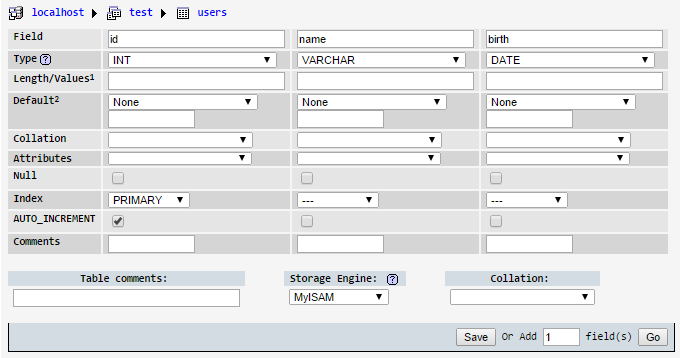

გამარჯობა,
სტატია გამიზნულია ქართველი PHP პროგრამისტებისთვის რომელთა ხელფასიც არ აღემატება 1000-1500 ლარს.

სტატიაში ჩვენ გავარკვევთ მიზეზს, თუ **რატომ შეადგენს საქართველოში  Microsoft .NET დეველოპერის ან Java დეველოპერის ხელფასი საშუალოდ 3000 ლარს და რატომ არ აღემატება PHP დეველოპერის საშუალო ხელფასი საქართველოში 1000 ლარს.** შეგახსენებთ რომ საშუალო ხელფასი გამოითვლება დეველოპერების ხელფასების ჯამის შეფარდებით დეველოპერების რაოდენობაზე. სტატიაში ასევე განვიხილავთ პრობლემის დაძლევის მეთოდსაც.

მეცნიერებმა იმსჯელეს აღნიშნულ საკითხზე დაახლოებით 10 წლის განმავლობაში და დაადგინეს, რომ რიგი გარემოებების ფონზე გამოირჩევა რამდენიმე ძირითადი მიზეზი. ჩვენ შევეცდებით ყურადღება გავამახვილოთ მათ შორის ყველაზე მნიშვნელოვანზე:

როგორც აღმოჩნდა NET, JAVA და PHP ტექნოლოგიებით შემუშავებულ გადაწყვეტებში მიღებული ანაზღაურების სიმცირის ძირითად ფაქტორს განაპირობებს რამდენიმე ხაზიანი განსხვავება სხვადასხვა ენებზე და PHP-ზე წარმოდგენილ კოდს შორის.

იმისათვის რომ თვალსაჩინო გავხადოთ რა სახის განსხვავებაზე გვაქვს საუბარი, მოვიყვანოთ მაგალითი, კერძოდ განვიხილოთ როგორ წყვეტს კონკრეტულ ამოცანას PHP პროგრამისტი და როგორ წყვეტს იგივე ამოცანას .NET ან JAVA პროგრამისტი. ორივე გადაწყვეტა წარმოვადგინოთ PHP-ის სინტაქსით რათა უფრო გასაგები გავხადოთ სხვაობის რაობა.

მაგალითისთვის განხვილოთ ამოცანა:

1. მოვამზადოთ პროექტი მომხმარებლის შესახებ ინფორმაციის მონაცემთა ბაზაში შესანახად და დავუშვათ რომ მომხმარებელს აქვს შემდეგი თვისებები:
	* იდენტიფიკატორი
	* სახელი
	* დაბადების თარიღი (ფორმატით yyyy-mm-dd)
2. ფაილში სახელად 'insert.php', შევიმუშავოთ PHP კოდი, რომელიც შექმნის მომხმარებელს, პირობითი სახელით "John", დაბადების თარიღით 1984-12-14 და დავუშვათ რომ შექმნილი მომხმარებლის იდენტიფიკატორი იქნება 1.
3. ფაილში სახელად 'select.php', პროგრამული კოდის გამოყენებით, მოვიძიოთ მომხმარებელი მონაცემთა ბაზაში, იდენტიფიკატორით 1.
4. ფაილში სახელად 'select.php', გამოვთვალოთ მომხმარებლის ასაკი, გამოვიტანოთ მომხამრებლის სახელი და ასაკი.

* დავუშვათ რომ მონაცემთა განსათავსებლად ვიყენებთ mysql სერვერს:
	* მისამართი: 127.0.0.1
	* მომხმარებელი: root
	* პაროლი: 1234
	* მონაცემთა ბაზა: test
* დავუშვათ რომ მონაცემთა ბაზის სერვერთან დაკავშირებას უზრუნველყოფს ფაილი 'config.php'

**საშუალო დონის PHP პროგრამისტი ამ ამოცანის გადასაწყვეტად შემდეგ ღონისძიებებს გაატარებს:**

1. phpMyAdmin-ის საშუალებით, შექმნის მონაცემთა ბაზას, შექმნის ცხრილს:

2. მისი 'insert.php' ფაილი დაახლოებით ასეთი სახით იქნება წარმოდგენილი:
```php
include './config.php';

mysql_query ("insert into users set name='John', birth='1984-12-14");
```
ამ კონკრეტულ შემთხვევაში არსებითი მნიშვნელობა არ აქვს - მომხმარებლის შექმნა mysql_query ფუნქციით მოხდება თუ PDO::query მეთოდით.

3.,4. ხოლო მისი 'select.php' ფაილი კი დაახლოებით ასე გამოიყურება:
```php
include './config.php';
include './helper.php';

$result = mysql_query ("select * from users where id=1");
$row = mysql_fetch_assoc($result);

$age = age($row['birth']);

echo $row['name']." ".$age;
```
ვიგულისხმოთ რომ PHP პროგრამისტმა ასაკის გამოსათვლელად შეიმუშავა ფუნქცია 'age' და განათავსა ფაილში 'helper.php', შიგთავსით:
```php
function age ($birth)
{
    return intval((time()-strtotime($birth))/(3600*24*365));
}
```

**განვიხილოთ დაახლოებით როგორ გამოიყურება პირობითად PHP-ის სინტაქსით .NET ან JAVA დეველოპერის მიერ შემუშავებული იგივე ამოცანის გადაწყვეტა:**

პროგრამისტმა შექმნა ფაილი 'model.php':

```php

namespace user;

class user
{
	public $id;
	public $name;
	public $birth;
	public function ___construct ($name=null, $birth=null)
	{
		$this->name = $name;
		$this->birth = $birth;
	}
	public function age ()
	{
		return intval((time()-strtotime($this->birth))/(3600*24*365));
	}
}

```

მისი 'insert.php' ასე გამოიყურება:
```php

	include './db.php';
	include './model.php';
	include './config.php';

	$database->save (new \user\user('John','1984-12-14'));

```

ხოლო მისი 'select.php' ფაილი კი ასე:
```php

	include './db.php';
	include './model.php';
	include './config.php';

	$user = $database->user->load (1);

	echo $user->name." ".$user->age();

```

* სადაც 'db.php' პირობითად წარმოადგენს ORM-ს.
* ORM - ერთგვარი დამხმარე ბიბლიოთეკის ტიპი, რომელიც განკუთვნილია კლასების ობიექტებისა და მონაცემეთა ბაზაში აქტიური ჩანაწერების დასაკავშირებლად.
* სასურველი იქნებოდა თუ პროგრამისტის მიერ გატარებულ ღონისძიებებს შორის, ყურადღებას პროგრამისტის მიერ მონაცემთა ბაზის ან ცხრილის არ შექმნის გარემოებასაც გამოვუყოფდით, ვინაიდან რაც არ უნდა უმნიშვნელო იყოს აღნიშნული ფაქტორი, მონაცემთა ბაზის/ცრილის (სურვილისამებრ) ავტომატურ შექმნა/სინქრონიზაციასაც თავისთავზე იღებს თანამედროვე ORM.
* ORM რომელიც კლასების აღწერის მიხედვით ქმნის მონაცემთა ბაზებს და ცხრილებს ეწოდება Code first სტილის ORM.

თუ კი მოყვანილ ორ მაგალითს შორის ძირითად განსხვავებას მიაგენით და გაგიჩნდათ ლოგიკური შესაბამისობა თქვენს ანაზღარუებასა და ამოცანის გადაწყვეტის მეთოდს შორის - თქვენ შეგიძლიათ იქონიოთ PHP პროგრამირებით, როდესმე მაღალი ანაზღაურების გაჩენის იმედიც.

დანართი: მაგალითებისთვის გამოყენებული 'config.php' ფაილები:

PHP პროგრამისტის 'config.php' ფაილი:
```php
mysql_connect ('127.0.0.1', 'root', '1234');
mysql_select_db ('test');
```

ORM მაგალითის კონფიგ ფაილი:
```php
$database = new \db\database ('mysql:host=127.0.0.1', 'test', 'root', '1234');
$database->add ('\user\user');
$database->update ();
```

* მეორე მაგალითისთვის გამოყენებულია მოცემული მომენტისთვის არსებული PHP ORM ბიბლიოთეკა http://github.com/hazardland/db.php